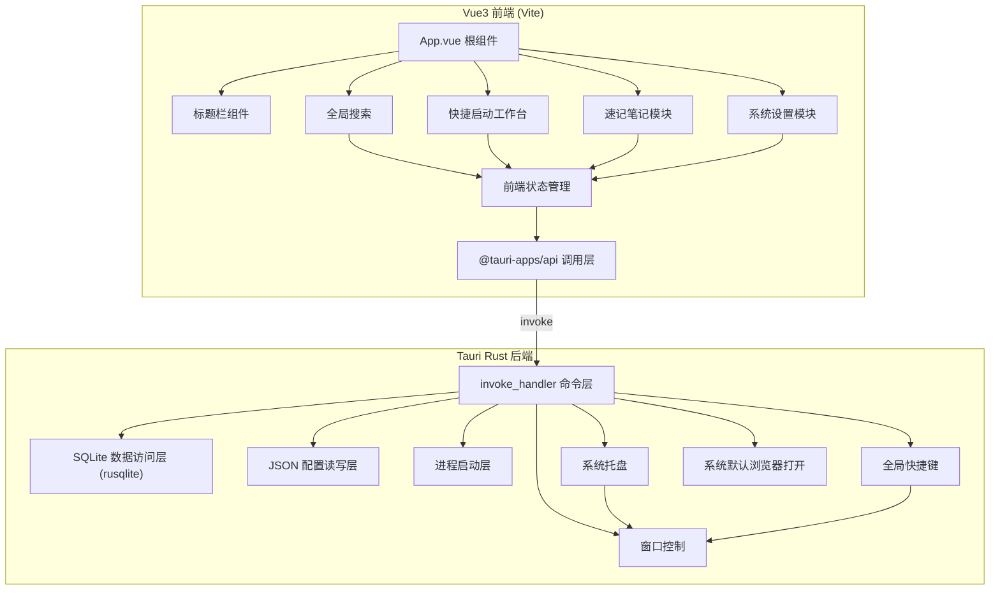

# Personal Workbench - 本地个人效率工作台

Feature Name: personal-workbench
Updated: 2026-08-01

## Description

基于 Tauri 2 + Vite + Vue3 + NaiveUI 构建的本地个人效率工作台桌面客户端。MVP 版本包含窗口基础能力（无边框、托盘常驻、全局快捷键）、快捷启动工作台（本地程序与网页书签）、速记笔记、系统设置四大模块。所有业务数据存于本地 SQLite，基础配置存于本地 JSON 文件，无主动联网上传行为。

## Architecture



### 架构说明

- **前后端边界**：前端仅负责交互展示与状态管理；系统文件访问、进程调用、持久化存储、窗口控制、托盘、全局快捷键全部由 Rust 后端实现，通过 Tauri `invoke` 命令层暴露。
- **数据分层**：业务数据（快捷资源、分组、笔记）走 SQLite；基础配置（主题、窗口位置尺寸、置顶、快捷键）走 JSON 文件。
- **单例窗口**：应用主窗口在 Tauri 初始化时创建，关闭按钮触发隐藏而非销毁，实现托盘常驻。
- **无边框窗口**：`decorations: false`，前端自制标题栏通过 `data-tauri-drag-region` 实现拖动。

## Components and Interfaces

### 前端组件

| 组件 | 职责 |
| ---- | ---- |
| `App.vue` | 根组件，路由容器，主题提供 |
| `components/TitleBar.vue` | 自制标题栏，最小化/最大化还原/关闭/置顶按钮，双击标题拖动 |
| `components/QuickLaunch.vue` | 快捷启动工作台视图 |
| `components/ResourceCard.vue` | 单个快捷资源卡片 |
| `components/ResourceForm.vue` | 快捷资源新增/编辑表单弹窗 |
| `components/ResourceGroup.vue` | 资源分组容器，支持拖拽排序 |
| `components/NotesView.vue` | 速记笔记视图（左列表右编辑） |
| `components/NoteList.vue` | 笔记条目列表 |
| `components/NoteEditor.vue` | 笔记编辑区域 |
| `components/SettingsView.vue` | 系统设置视图 |
| `components/GlobalSearch.vue` | 全局搜索框与结果面板 |

### Rust 命令层（`src-tauri/src/`）

```
src-tauri/src/
├── main.rs          # 入口
├── lib.rs           # Builder 组装、托盘、全局快捷键、窗口事件
├── commands.rs      # invoke 命令分发
├── db.rs            # SQLite 初始化与迁移
├── models.rs        # 数据结构（Group, Resource, Note）
├── repo/
│   ├── mod.rs
│   ├── group.rs     # 分组 CRUD + 排序
│   ├── resource.rs  # 资源 CRUD + 排序 + 分组移动
│   └── note.rs      # 笔记 CRUD + 全文检索
├── config.rs        # JSON 配置读写
├── process.rs       # 本地程序启动
├── tray.rs          # 系统托盘
└── shortcut.rs      # 全局快捷键
```

### invoke 命令接口

| 命令 | 参数 | 返回 | 说明 |
| ---- | ---- | ---- | ---- |
| `get_initial_data` | - | `{ groups, resources, notes, config }` | 启动初始化加载 |
| `create_group` | `{ name }` | Group | 新建分组 |
| `update_group` | `{ id, name }` | Group | 重命名分组 |
| `delete_group` | `{ id }` | - | 删除分组（组内资源一并删除或移动） |
| `reorder_groups` | `{ ids: number[] }` | - | 分组排序持久化 |
| `create_resource` | `{ group_id, kind, name, target, icon, args }` | Resource | 新增快捷资源 |
| `update_resource` | `{ id, ... }` | Resource | 编辑快捷资源 |
| `delete_resource` | `{ id }` | - | 删除快捷资源 |
| `reorder_resources` | `{ ids: number[], group_id }` | - | 资源排序（组内/跨组）持久化 |
| `launch_resource` | `{ id }` | - | 启动本地程序或打开网页 |
| `pick_program_file` | - | `{ path, name }` | 系统文件选择器选择可执行文件 |
| `create_note` | `{ title }` | Note | 新建笔记 |
| `update_note` | `{ id, title, content }` | Note | 保存笔记 |
| `delete_note` | `{ id }` | - | 删除笔记 |
| `search_all` | `{ keyword }` | `{ resources, notes }` | 全局检索 |
| `save_config` | `{ config }` | Config | 保存配置 |
| `get_config` | - | Config | 读取配置 |
| `set_window_always_on_top` | `{ value }` | - | 窗口置顶切换 |
| `save_window_state` | - | - | 保存窗口位置尺寸 |
| `minimize_window` | - | - | 最小化窗口 |
| `toggle_maximize` | - | - | 最大化/还原 |
| `hide_to_tray` | - | - | 隐藏至托盘 |
| `toggle_window_visibility` | - | - | 切换窗口显示/隐藏 |
| `quit_app` | - | - | 退出应用 |

## Data Models

### SQLite 表结构（`app.db`）

```sql
-- 资源分组
CREATE TABLE groups (
  id INTEGER PRIMARY KEY AUTOINCREMENT,
  name TEXT NOT NULL,
  sort_order INTEGER NOT NULL DEFAULT 0,
  created_at TEXT NOT NULL DEFAULT (datetime('now')),
  updated_at TEXT NOT NULL DEFAULT (datetime('now'))
);

-- 快捷资源
CREATE TABLE resources (
  id INTEGER PRIMARY KEY AUTOINCREMENT,
  group_id INTEGER NOT NULL REFERENCES groups(id) ON DELETE CASCADE,
  kind TEXT NOT NULL CHECK (kind IN ('app', 'web')),
  name TEXT NOT NULL,
  target TEXT NOT NULL,           -- app: 可执行文件路径; web: 网址
  icon TEXT,                      -- 图标路径或数据 URI
  args TEXT,                      -- 附加启动参数 (仅 app)
  sort_order INTEGER NOT NULL DEFAULT 0,
  created_at TEXT NOT NULL DEFAULT (datetime('now')),
  updated_at TEXT NOT NULL DEFAULT (datetime('now'))
);

-- 速记笔记
CREATE TABLE notes (
  id INTEGER PRIMARY KEY AUTOINCREMENT,
  title TEXT NOT NULL DEFAULT '',
  content TEXT NOT NULL DEFAULT '',
  created_at TEXT NOT NULL DEFAULT (datetime('now')),
  updated_at TEXT NOT NULL DEFAULT (datetime('now'))
);

CREATE INDEX idx_resources_group ON resources(group_id);
CREATE INDEX idx_notes_updated ON notes(updated_at DESC);
```

### JSON 配置（`app.json`）

```json
{
  "theme": "light",
  "window": {
    "width": 1100,
    "height": 760,
    "x": null,
    "y": null,
    "always_on_top": false
  }
}
```

存储位置：`dirs::config_dir()/com.workbench/`。

## Correctness Properties

1. 关闭窗口按钮只隐藏窗口，不退出进程；进程仅在托盘"退出"或快捷键退出时结束。
2. 分组排序与资源排序（含跨分组）操作后，`sort_order` 必须与前端渲染顺序一致。
3. 删除分组时，组内资源级联删除（`ON DELETE CASCADE`），不可留下孤儿资源。
4. 本地程序启动失败（文件不存在、权限不足）时，返回错误并在前端展示提示，不导致应用崩溃。
5. 配置写入采用原子写入（临时文件 + rename），避免写一半损坏配置文件。
6. 全局快捷键注册失败（组合键被占用）时，应用仍可正常运行，仅快捷键不可用并记录日志。
7. 笔记文本内容变化后必须持久化保存，重启应用不丢失。
8. 除打开外部网页外，应用无任何主动网络请求。

## Error Handling

| 场景 | 处理策略 |
| ---- | ---- |
| SQLite 初始化失败 | 弹出错误提示，应用退出，日志记录原因 |
| 目标程序文件不存在 | 返回错误码，前端弹窗提示"程序路径无效" |
| 启动程序无权限 | 返回错误码，前端提示权限问题 |
| 全局快捷键冲突 | 捕获注册失败，记录日志，应用继续运行 |
| 配置文件损坏 | 回退默认配置，保留损坏文件为 `.bak` |
| 打开浏览器失败 | 返回错误，前端提示无法打开链接 |
| 搜索无结果 | 返回空列表，前端展示空状态 |
| 拖拽排序并发冲突 | 前端单线程操作，命令串行执行，返回最新排序结果 |

## Test Strategy

### Rust 单元测试
- 分组/资源/笔记 CRUD 与排序逻辑（使用临时 SQLite 内存库）
- 配置读写与原子写
- 跨分组移动资源时 sort_order 重排

### 前端测试
- 全局搜索过滤逻辑（资源名 + 笔记标题 + 笔记内容）
- 笔记列表摘要截断逻辑
- 拖拽排序产生的 order 序列正确性

### 手工验收清单（对应需求 AC）
1. 无边框窗口 + 自制标题栏拖动/最小化/最大化/关闭隐藏
2. 托盘单击切换窗口、右键菜单、退出
3. 全局快捷键 Ctrl+Shift+Space 唤起/隐藏
4. 窗口位置尺寸记忆与恢复
5. 窗口置顶开关
6. 本地程序选择/参数/启动
7. 网页书签默认浏览器打开
8. 分组管理 + 拖拽排序（组内/跨组）+ 右键菜单 + 增删改
9. 笔记新建/编辑/保存/列表/摘要/切换/删除
10. 全局搜索检索资源与笔记
11. 主题切换持久化
12. 验证无外部网络连接

## References

[^1]: (Website) - [Tauri 2 Window 配置](https://tauri.app/learn/window-customization/)
[^2]: (Website) - [Tauri System Tray](https://tauri.app/learn/system-tray/)
[^3]: (Website) - [Tauri Global Shortcuts](https://tauri.app/learn/global-shortcuts/)
